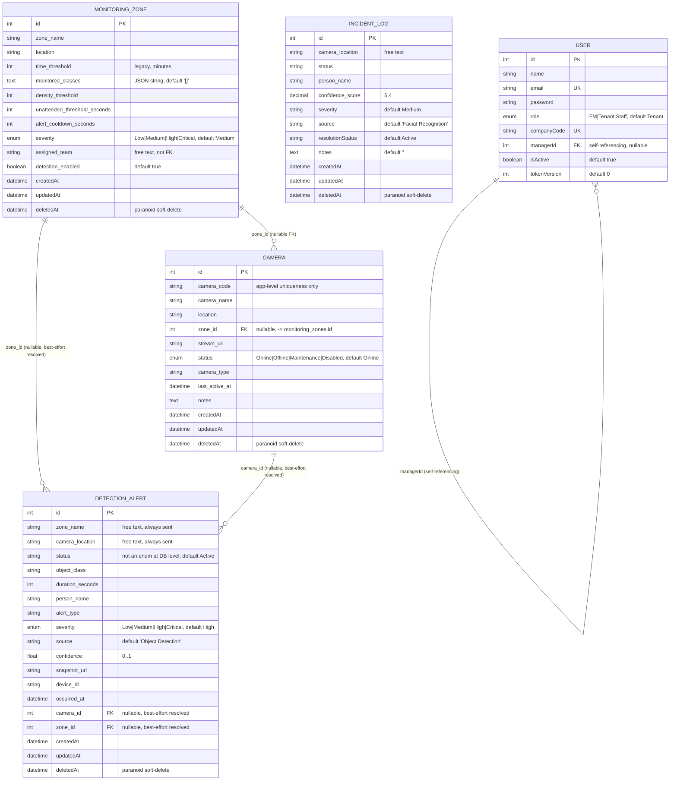

# FlowGuard — Object Detection / SecurePi Database Documentation

Scope: this document covers the database entities that back the **Object Detection** and **SecurePi** feature — `Camera`, `DetectionAlert`, `MonitoringZone`, `IncidentLog`, and the relevant ownership/audit fields on `User`. It is derived directly from the current implementation (models, routes, sync logic, seed data, and tests) as of branch `feature/object-detection-space`. It does not cover unrelated domains (Attendance, Booking, ChatTranscript, KnowledgeBase, SupportTicket, SecurityLogs, Invite, Staff) except where `User` fields are shared infrastructure.

---

## 1. Database Overview

FlowGuard uses a single relational database to store facility-management data. For this feature area, four tables work together to support an edge-camera-driven unattended-object detection pipeline:

- **`monitoring_zones`** — configurable physical/logical zones (e.g. "Loading Bay") with detection thresholds and severity defaults.
- **`cameras`** — camera inventory, each optionally assigned to a zone.
- **`detection_alerts`** — alerts raised by the Python AI engine or a SecurePi edge device when an unattended object (or other detection event) is observed. Alerts carry free-text zone/camera identifiers plus best-effort resolved foreign keys.
- **`incident_logs`** — a general incident ledger (originally built for facial recognition) that Object Detection alerts are also mirrored into for a unified incident view. It has **no foreign keys** linking it back to `detection_alerts`.
- **`users`** — referenced only for authentication/role checks (`FM`, `Staff`, `Tenant`) that gate every route in this feature; no direct FK relationship to the four tables above.

## 2. Database Technology and ORM

- **Database:** PostgreSQL (per `server/.env.example` comment: "PostgreSQL (Neon / Supabase / Render)").
- **ORM:** Sequelize, using the `pg` driver. Dialect is hardcoded as `'postgres'` in `server/models/index.js` — it is not configurable via environment variable.
- **Connection config** (`server/.env.example`): `DB_HOST`, `DB_PORT`, `DB_NAME`, `DB_USER`, `DB_PWD`. (Values are illustrative placeholders only; actual secrets live in `.env`, which was not read.)
- **Schema management:** There are **no migration files** and **no `.sql` schema files** anywhere in the repo. `server/index.js` calls `db[modelName].sync({ alter: true })` **once per model** at server startup (not a single `sequelize.sync()`), logging progress and isolating failures per model so one bad model doesn't prevent the rest of the server from starting. This means the Sequelize model definitions are the sole source of truth for the schema — there is no independent migration history to diff against.
- **Auto-loading:** every file in `server/models/` (except `index.js`) is loaded automatically and its `associate(models)` function (if present) is invoked to wire up associations.

## 3. Entity Relationship Diagram

**Not shown as a real relationship:** `DETECTION_ALERT` and `INCIDENT_LOG` are linked only by application logic (see §6), not by a database foreign key. There is no line between them in the ERD because none exists in the schema.

## 4. Table-by-Table Data Dictionary

All four feature tables use Sequelize's default implicit `id` (`INTEGER`, auto-increment, primary key) plus `createdAt`/`updatedAt` timestamps, and all are `paranoid: true` (adds a `deletedAt` column; `.destroy()` soft-deletes by setting `deletedAt` rather than removing the row, unless called with `force: true`).

### 4.1 `monitoring_zones` (model: `MonitoringZone`, file: `server/models/MonitoringZone.js`)

| Column | Type | Null | Default | Notes |
|---|---|---|---|---|
| `id` | INTEGER | No | auto-increment | PK |
| `zone_name` | STRING(255) | No | — | |
| `location` | STRING(255) | No | — | |
| `time_threshold` | INTEGER | No | — | Legacy unattended-object threshold in **minutes**. Read directly via raw SQL by the Python AI engine (`ai-service/main.py::_refresh_zone_info`), which falls back to `time_threshold * 60` seconds when `unattended_threshold_seconds` is unset. |
| `monitored_classes` | TEXT | No | `'[]'` | JSON array **stored as a string**; serialized/parsed by `server/routes/zones.js` (`serializeZone`, `parseMonitoredClasses`) on every read/write. |
| `density_threshold` | INTEGER | Yes | — | |
| `unattended_threshold_seconds` | INTEGER | Yes | — | Takes precedence over legacy `time_threshold` when present. |
| `alert_cooldown_seconds` | INTEGER | Yes | — | |
| `severity` | ENUM(`Low`,`Medium`,`High`,`Critical`) | No | `'Medium'` | |
| `assigned_team` | STRING(255) | Yes | — | Free-text soft link into a (localStorage-only) response-team directory — **not** a foreign key. |
| `detection_enabled` | BOOLEAN | No | `true` | |
| `createdAt` / `updatedAt` / `deletedAt` | DATE | — | — | Standard Sequelize timestamps; paranoid soft-delete. |

### 4.2 `cameras` (model: `Camera`, file: `server/models/Camera.js`)

| Column | Type | Null | Default | Notes |
|---|---|---|---|---|
| `id` | INTEGER | No | auto-increment | PK |
| `camera_code` | STRING(50) | No | — | Intended unique identifier, but **no DB-level unique constraint** — uniqueness is enforced only in `server/routes/cameras.js` via a case-insensitive lookup before create/update. |
| `camera_name` | STRING(255) | No | — | |
| `location` | STRING(255) | No | — | |
| `zone_id` | INTEGER | Yes | — | FK → `monitoring_zones.id` (see §5). |
| `stream_url` | STRING(500) | Yes | — | |
| `status` | ENUM(`Online`,`Offline`,`Maintenance`,`Disabled`) | No | `'Online'` | |
| `camera_type` | STRING(100) | Yes | — | |
| `last_active_at` | DATE | Yes | — | Set to `new Date()` on every create/update in `server/routes/cameras.js`. |
| `notes` | TEXT | Yes | — | |
| `createdAt` / `updatedAt` / `deletedAt` | DATE | — | — | Paranoid soft-delete. |

### 4.3 `detection_alerts` (model: `DetectionAlert`, file: `server/models/DetectionAlert.js`)

| Column | Type | Null | Default | Notes |
|---|---|---|---|---|
| `id` | INTEGER | No | auto-increment | PK |
| `zone_name` | STRING(255) | No | — | Free-text zone identifier as sent by the caller (AI engine / edge device / manual JWT user). Always required. |
| `camera_location` | STRING(255) | No | — | Free-text camera/location identifier. Always required. |
| `status` | STRING(50) | No | `'Active'` | **Not a DB enum** — validated only in route code against `['Active','Acknowledged','Investigating','Dispatched','Escalated','Cleared']`. |
| `object_class` | STRING(100) | Yes | — | Defaults to `'package-like object'` at the edge-ingest route if omitted. |
| `duration_seconds` | INTEGER | Yes | — | |
| `person_name` | STRING(255) | Yes | — | |
| `alert_type` | STRING(100) | Yes | — | Defaults to `'Unattended Object'` at the edge-ingest route if omitted. |
| `severity` | ENUM(`Low`,`Medium`,`High`,`Critical`) | No | `'High'` | |
| `source` | STRING(100) | No | `'Object Detection'` | Edge-ingest route defaults this to `'SecurePi Edge Node'` instead if omitted. |
| `confidence` | FLOAT | Yes | — | Clamped to `[0, 1]` by route code (`parseConfidence`). |
| `snapshot_url` | STRING(500) | Yes | — | Accepts either `snapshot_url` or `snapshot_path` from the request body (route-level aliasing, not a DB alias). |
| `device_id` | STRING(100) | Yes | — | |
| `occurred_at` | DATE | Yes | — | Accepts either `timestamp` or `occurred_at` from the request body. |
| `camera_id` | INTEGER | Yes | — | FK → `cameras.id`. Best-effort resolved server-side from `camera_location` (see §5) — never required by the client. |
| `zone_id` | INTEGER | Yes | — | FK → `monitoring_zones.id`. Best-effort resolved server-side from `zone_name`. |
| `createdAt` / `updatedAt` / `deletedAt` | DATE | — | — | Paranoid soft-delete for normal deletes; a nightly purge job (see §6) hard-deletes alerts older than 30 days with `force: true`. |

### 4.4 `incident_logs` (model: `IncidentLog`, file: `server/models/IncidentLog.js`)

| Column | Type | Null | Default | Notes |
|---|---|---|---|---|
| `id` | INTEGER | No | auto-increment | PK |
| `camera_location` | STRING(255) | No | — | |
| `status` | STRING(50) | No | — | For Object-Detection-originated rows this is hardcoded to `'UNATTENDED_OBJECT'` by the bridge logic (§6); no enum/CHECK constraint exists at the model level. |
| `person_name` | STRING(255) | Yes | — | |
| `confidence_score` | DECIMAL(5,4) | Yes | — | Always `null` for Object-Detection-bridged rows (facial-recognition confidence is a different pipeline). |
| `severity` | STRING(20) | Yes | `'Medium'` | Plain string, not an ENUM — for bridged rows, derived from `duration_seconds` via `severityFromDuration()` in `server/routes/detectionAlerts.js` (`<120s → Low`, `<300s → Medium`, `<600s → High`, `≥600s → Critical`). |
| `source` | STRING(50) | Yes | `'Facial Recognition'` | Overridden to `'Object Detection'` for bridged rows. |
| `resolutionStatus` | STRING(50) | No | `'Active'` | |
| `notes` | TEXT | Yes | `''` | For bridged rows: `"[Object Detection] Zone: <zone_name>"`. |
| `createdAt` / `updatedAt` / `deletedAt` | DATE | — | — | Paranoid soft-delete. |

**No `associate()` method exists on this model** — it has zero foreign keys of any kind.

### 4.5 `users` (model: `User`, file: `server/models/User.js`) — fields relevant to this feature only

| Column | Type | Null | Default | Notes |
|---|---|---|---|---|
| `id` | INTEGER | No | auto-increment | PK |
| `email` | STRING(100) | No | — | **Unique** (DB-level `unique: true`). |
| `role` | ENUM(`FM`,`Tenant`,`Staff`) | — | `'Tenant'` | Every Camera/Zone/DetectionAlert route is gated by `requireRole(...)` against this field: `FM` = full CRUD, `Staff` = read + alert acknowledge, `Tenant` = no access to these routes. |
| `companyCode` | STRING(50) | Yes | — | **Unique**. Unrelated to Object Detection directly but shares the `users` table. |
| `managerId` | INTEGER | Yes | — | Self-referencing FK (`Manager`/`StaffMembers` associations); not linked to Camera/Zone/Alert. |
| `isActive` | BOOLEAN | No | `true` | Checked by the `verifyToken` auth middleware to reject suspended accounts on every request, including all Camera/Zone/DetectionAlert routes. |
| `tokenVersion` | INTEGER | No | `0` | Stamped into JWTs and compared per-request for session revocation; applies to all authenticated routes in this feature. |

`Camera`, `MonitoringZone`, `DetectionAlert`, and `IncidentLog` have **no foreign key to `users`** — there is no "created by" / "owner" column on any of them. Ownership is enforced purely at the route layer via role checks, not via a DB relationship.

## 5. Primary-Key and Foreign-Key Explanation

- All five tables use a Sequelize-default surrogate primary key: `id INTEGER`, auto-incrementing.
- Real, association-backed foreign keys (declared via `belongsTo`/`hasMany` in each model's `associate()`):
  - `cameras.zone_id → monitoring_zones.id` (`Camera.belongsTo(MonitoringZone, { foreignKey: 'zone_id', as: 'zone' })`, reverse: `MonitoringZone.hasMany(Camera, { foreignKey: 'zone_id', as: 'cameras' })`).
  - `detection_alerts.camera_id → cameras.id` (`DetectionAlert.belongsTo(Camera, { foreignKey: 'camera_id', as: 'camera' })`).
  - `detection_alerts.zone_id → monitoring_zones.id` (`DetectionAlert.belongsTo(MonitoringZone, { foreignKey: 'zone_id', as: 'zone' })`).
  - `users.managerId → users.id` (self-referencing, unrelated to this feature but on the same table used for role checks).
- **None of these FK declarations specify `onDelete`/`onUpdate`** — Sequelize/Postgres default referential behavior applies (effectively `NO ACTION`/`RESTRICT` at the DB level unless Postgres defaults otherwise, since no explicit cascade is configured). There is no code in this repo that cleans up `cameras.zone_id` or `detection_alerts.zone_id`/`camera_id` when the referenced zone/camera is deleted — because those tables are `paranoid: true`, deletes are normally soft (row remains, FK stays valid), but a hard delete or the 30-day alert purge could leave a dangling reference in principle if a zone/camera were hard-deleted (no route currently hard-deletes Camera or MonitoringZone).
- **`detection_alerts.zone_id`/`camera_id` are populated by application code, not by the client.** `resolveLinks()` (duplicated in `server/routes/detectionAlerts.js` and `server/routes/edgeDetectionAlerts.js`) looks up `MonitoringZone.findOne({ where: { zone_name } })` and `Camera.findOne({ where: { [Op.or]: [{ camera_name: camera_location }, { location: camera_location }] } })` at alert-creation time. If no match is found, the FK columns stay `null` — the alert is still created successfully using only the free-text `zone_name`/`camera_location` fields. This is a **best-effort, name-matching enrichment**, not enforced referential integrity.
- **`incident_logs` has no foreign keys at all.**

## 6. Relationship Explanation

- **MonitoringZone → Camera (one-to-many):** a zone can have many cameras (`zone.cameras`); a camera belongs to at most one zone (`camera.zone`), and `zone_id` is nullable — a camera can exist unassigned.
- **MonitoringZone → DetectionAlert (one-to-many, soft):** resolved by matching the alert's free-text `zone_name` against `monitoring_zones.zone_name`. Multiple zones could theoretically share a name (no unique constraint on `zone_name`), in which case `findOne` picks the first match non-deterministically from the DB's perspective.
- **Camera → DetectionAlert (one-to-many, soft):** resolved by matching the alert's free-text `camera_location` against either `cameras.camera_name` OR `cameras.location`. Same caveat — no uniqueness guarantee on either column.
- **DetectionAlert ↔ IncidentLog (application-level bridge, not a DB relationship):** in `server/routes/detectionAlerts.js` (lines 130–142), immediately after a `DetectionAlert` is created and the HTTP response is sent, the route fire-and-forgets an `IncidentLog.create(...)` call populated from the same request data (mapped/transformed per §4.4). This call is **not awaited before responding** and its failure is only logged (`console.error`), never surfaced to the caller or retried. There is **no shared ID** between the resulting `detection_alerts` row and `incident_logs` row — they cannot be joined in SQL; the only correlation is the human-readable zone name embedded in `incident_logs.notes` and best-effort matching `camera_location`/timestamp proximity.
- **User → Camera/MonitoringZone/DetectionAlert/IncidentLog:** no direct relationship. Access control is entirely role-based (`requireRole('FM')`, `requireRole('FM','Staff')`) applied per-route, not ownership-based.

## 7. CRUD Mapping

### `cameras` (routes in `server/routes/cameras.js`, mounted at `/api/cameras`, all behind `verifyToken`)

| Method | Path | Role | Operation |
|---|---|---|---|
| GET | `/` | FM, Staff | List all cameras (includes `zone`), ordered by `createdAt` desc |
| GET | `/:id` | FM, Staff | Read one camera (includes `zone`) |
| POST | `/` | FM | Create — validates required fields, `status` enum, zone existence, case-insensitive `camera_code` duplicate check (409 on conflict) |
| PUT | `/:id` | FM | Update — partial, same validations as create; re-checks duplicate code excluding self |
| DELETE | `/:id` | FM | Sets `status: 'Disabled'`, then soft-deletes via `.destroy()` (paranoid) |

### `monitoring_zones` (routes in `server/routes/zones.js`, mounted at `/api/zones`, all behind `verifyToken`)

| Method | Path | Role | Operation |
|---|---|---|---|
| GET | `/` | FM, Staff | List all zones, `monitored_classes` deserialized from JSON string to array |
| POST | `/` | FM | Create — requires `zone_name`, `location`, `time_threshold`; validates numeric thresholds, `severity` enum, non-empty `monitored_classes` |
| PUT | `/:id` | FM | Update — partial, same validations |
| DELETE | `/:id` | FM | Soft-deletes via `.destroy()` (paranoid) |

### `detection_alerts` (routes in `server/routes/detectionAlerts.js`, mounted at `/api/detection-alerts`)

| Method | Path | Auth | Operation |
|---|---|---|---|
| GET | `/` | `verifyToken` + FM/Staff | List up to 50 alerts, optional `status` filter, ordered by `createdAt` desc |
| POST | `/` | `verifyServiceOrRole('FM','Staff')` (AI engine service key **or** FM/Staff JWT) | Create — validates required `zone_name`/`camera_location`, `status`/`severity` enums; resolves `zone_id`/`camera_id`; **also fire-and-forget creates an `incident_logs` row** |
| PUT | `/:id` | `verifyToken` + FM/Staff | Update — only `status`, validated against the fixed list |
| *(no DELETE route)* | — | — | A background job (`purgeStaleLogs`, runs at startup +20s and every 24h) hard-deletes (`force: true`) alerts with `createdAt` older than 30 days |

### `detection_alerts` via edge ingest (route in `server/routes/edgeDetectionAlerts.js`, mounted at `/api/edge`, full path `/api/edge/detection-alerts`)

| Method | Path | Auth | Operation |
|---|---|---|---|
| POST | `/detection-alerts` | Bearer token compared to `EDGE_INGEST_TOKEN` env var (distinct secret from the AI service key; no JWT/user role involved) | Create — same shape/validation as above, but defaults `object_class`→`'package-like object'`, `alert_type`→`'Unattended Object'`, `source`→`'SecurePi Edge Node'` when omitted. **Does not bridge to `incident_logs`** — only the JWT/service-key route does. |

`incident_logs` itself has **no dedicated CRUD routes** in the areas inspected — the only writes observed are the fire-and-forget bridge from `POST /api/detection-alerts`.

## 8. Validation and Integrity Rules

- **Application-layer only** (no DB CHECK constraints beyond ENUM types): `status`, `severity` on alerts/zones/cameras are validated against fixed arrays in route code before insert/update.
- `Camera.status` and `MonitoringZone.severity`/`DetectionAlert.severity` are true Postgres ENUM columns (defined via Sequelize `DataTypes.ENUM`), so the database itself will reject out-of-range values at the column level, independent of the route-level check.
- `DetectionAlert.status` and `IncidentLog.status`/`severity`/`source`/`resolutionStatus` are plain `STRING` columns — the database will accept any string; only the Express route enforces the allowed-values list, and only for `DetectionAlert.status` (not for `IncidentLog`, which has no route-level validation since it has no dedicated route).
- `Camera.camera_code` uniqueness is enforced only by an application-level case-insensitive lookup (`sequelize.fn('LOWER', ...)`) before create/update — **not** a database unique index or constraint. Two rows with the same code could exist if inserted through any path that bypasses this route (e.g. a future seed script or direct DB write).
- `MonitoringZone.zone_name` and `Camera.camera_name`/`location` have **no uniqueness constraint**, yet are used as the sole matching key for `resolveLinks()` — duplicate names will cause non-deterministic FK resolution on `detection_alerts`.
- `monitored_classes` requires at least one non-empty entry when supplied (route-level check in `zones.js`); stored as a JSON-encoded string in a `TEXT` column, not a native array/JSON column type.
- `confidence` on `DetectionAlert` is clamped into `[0, 1]` by route code (`parseConfidence`), not by a DB constraint.
- `Camera.zone_id` and any `zone_id`/`camera_id` referenced in POST/PUT bodies for cameras are checked for existence (`findByPk`) before being persisted; if the referenced zone doesn't exist, the request is rejected with 400 rather than allowing a dangling FK — but this check only occurs for camera creation/update through the standard route, not for the FK values written into `detection_alerts` (those are always resolved server-side from existing rows, so they can't dangle by construction, but can be `null` if no match is found).

## 9. Sensitive-Data Considerations

- None of the four core feature tables (`cameras`, `monitoring_zones`, `detection_alerts`, `incident_logs`) store credentials, tokens, or PII beyond `person_name` (a plain string, potentially containing a real name) and `snapshot_url`/`snapshot_path` (a pointer to an image that may contain a person's likeness). No column-level encryption or masking is applied to these fields at the database layer.
- `detection_alerts` rows are hard-deleted after 30 days by an automatic purge job — this is a built-in data-retention control worth noting for any privacy/PDPA discussion, though it is not documented as such in code comments (the comment only says "Purge detection alerts older than 30 days").
- Access to all Camera/Zone/DetectionAlert data is gated by JWT (`verifyToken`) plus role (`FM`/`Staff`); `Tenant`-role users cannot read or write any of these tables through the inspected routes.
- The edge-ingest route (`/api/edge/detection-alerts`) is protected by a single shared static bearer token (`EDGE_INGEST_TOKEN`) rather than per-device credentials — any compromised edge device's token grants alert-creation access from any source IP with no additional binding (e.g. to `device_id`).
- `snapshot_url` values are stored as opaque strings with no validation that they point to an authorized/internal location — the frontend (`ObjectDetection.jsx`) renders them directly as a link.

## 10. Known Limitations or Schema Inconsistencies

- **No migrations or schema files exist.** The only schema-evolution mechanism is `sync({ alter: true })` per model at every server boot, which can silently apply column alterations in a shared/production database with no reviewable migration history and no rollback path.
- **`incident_logs` is structurally disconnected from `detection_alerts`.** It has no FK, no shared identifier, and no dedicated CRUD routes visible in this inspection — the only write path is a fire-and-forget side effect of alert creation, whose failures are swallowed (logged only). If this bridge call throws, the `IncidentLog` row is silently never created while the `DetectionAlert` still succeeds — the two ledgers can drift out of sync with no reconciliation.
- **`detection_alerts.status` is a free-form STRING, not an ENUM**, unlike `severity`/`Camera.status`/`MonitoringZone.severity`, which are true Postgres ENUMs. This is an inconsistency in how "closed set of values" fields are modeled across the schema.
- **`Camera.camera_code` has no DB-level uniqueness** despite functioning as a business key; enforcement is entirely dependent on every write path going through the `cameras.js` route handlers.
- **No `onDelete`/`onUpdate` cascade behavior is declared on any association.** Combined with `paranoid: true` on all four tables, orphaned FK values are unlikely in normal operation (nothing hard-deletes a zone or camera), but the 30-day alert purge and any manual hard-delete of a zone/camera would not clean up dependent rows.
- **Best-effort FK resolution by name matching** (`zone_name`/`camera_location` → `zone_id`/`camera_id`) means `detection_alerts.zone_id`/`camera_id` can be `null` even when a "matching" zone/camera exists, if the free-text values don't exactly match `zone_name`/`camera_name`/`location` (case-sensitive, no fuzzy matching), and can resolve to the wrong row if names are duplicated.
- **Two near-duplicate implementations of `resolveLinks()` and the create-alert validation logic** exist independently in `server/routes/detectionAlerts.js` and `server/routes/edgeDetectionAlerts.js` — any future change to alert validation rules must be applied in both places or the two ingestion paths will diverge (the edge-ingest path already differs slightly in its default field values and does not bridge to `IncidentLog`).
- **`server/seed.js` seeds only a `User` row** (an FM admin account) — no seed data exists for `cameras`, `monitoring_zones`, or `detection_alerts`, so a fresh environment starts with empty tables for this feature.
- **`MonitoringZone.monitored_classes` is stored as a JSON-encoded string in a `TEXT` column** rather than a native array or JSON/JSONB column, requiring manual `JSON.parse`/`JSON.stringify` in route code on every read/write and offering no DB-level query support over its contents.
- **`MonitoringZone.time_threshold` (legacy, minutes) and `unattended_threshold_seconds` (current, seconds) coexist** with precedence logic living in the external Python AI service rather than in the Node model/route layer, making the effective threshold non-obvious from the schema alone.
