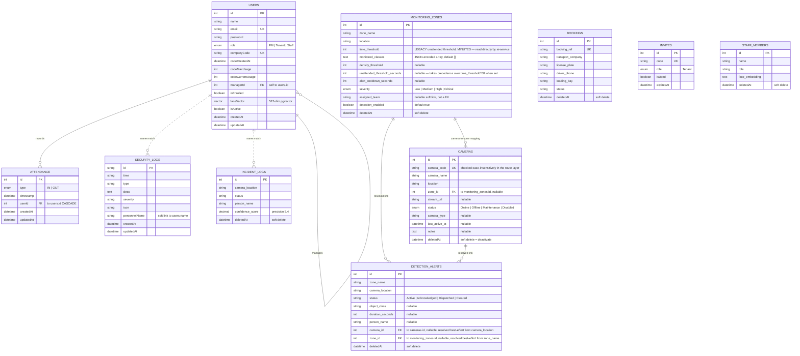

# FlowGuard – Entity Relationship Diagram

**Solid line** = enforced foreign key. **Dotted line** = soft link by name (no DB-level FK).
`CAMERAS`, `MONITORING_ZONES`, and `DETECTION_ALERTS` (object-detection module — Camera Inventory
and Detection Setup) added 2026-07-06; see `docs/camera-inventory-detection-setup-api.md` for the
full API/field reference. Remaining teammate tables (Support_Tickets, Chat_Transcripts, etc.)
should still be added to complete the full-system ER.