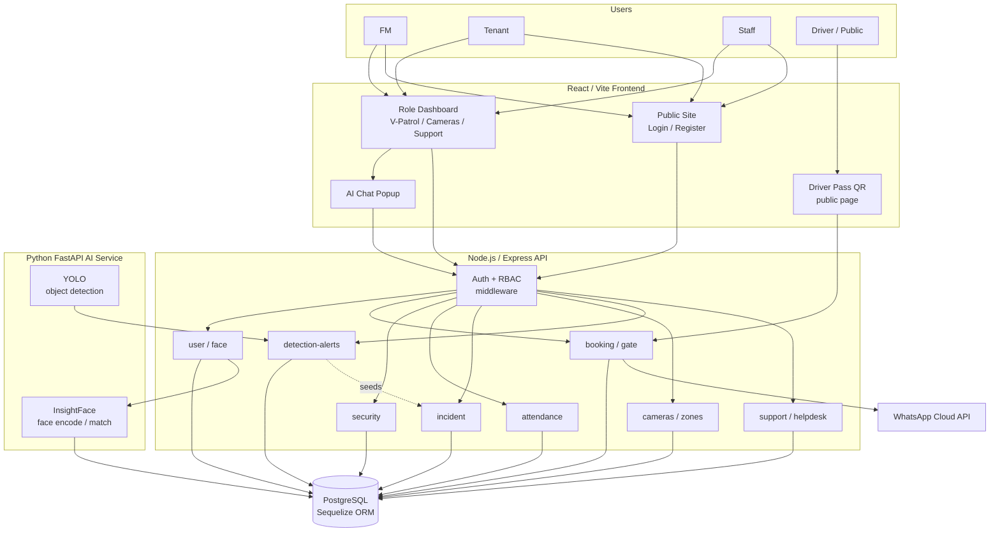
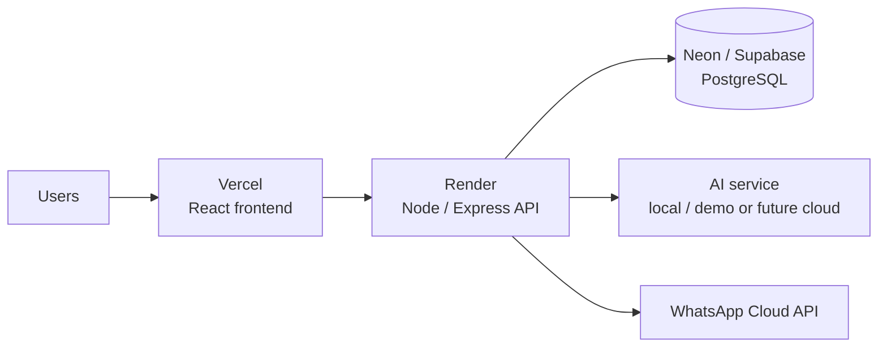

# FlowGuard — System Architecture Diagram (merged system)

## Planned deployment

## Notes

- **Frontend (React/Vite):** public site, login/register, a role-aware dashboard (V-Patrol, Cameras,
  Object Detection, Support Dashboard, Logistics), a public Driver Pass QR page, and the AI Chat Popup.
- **Backend (Node/Express):** every request passes through JWT auth + RBAC before reaching the route
  groups — `user`/face, `booking`/gate, `security`, `attendance`, `incident`, `cameras`/`zones`,
  `detection-alerts`, and `support`/helpdesk.
- **AI service (Python FastAPI):** InsightFace encodes/matches faces; YOLO detects objects and POSTs
  alerts to the backend `detection-alerts` route (which can seed incident logs). Face embeddings are
  stored as a PostgreSQL `FLOAT[]` array (`faceVector`); **pgvector is not required**.
- **Helpdesk flow:** the AI Chat Popup talks to `support` routes — chatbot sessions are saved as
  **ChatTranscript**, an unresolved chat can auto-create a **SupportTicket**, and answers are matched
  against the **KnowledgeBase** FAQ table.
- **Object-detection flow:** **Camera** + **MonitoringZone** CRUD configure the zones; YOLO produces
  **DetectionAlert** records that can seed **IncidentLog** entries.
- **WhatsApp Cloud API:** driver notifications for logistics; simulated locally, real mode when valid
  env credentials are enabled. No secrets are committed.
- **Deployment intent:** Vercel (frontend), Render (backend), Neon/Supabase (PostgreSQL). The AI
  service (InsightFace/YOLO) is heavy, so it runs locally for the demo, with cloud hosting as a stretch
  goal. After deploying, `FRONTEND_URL` must be updated so WhatsApp driver-pass links point to the live site.
- **After editing these diagrams, regenerate** `design/png/architecture-diagram.png` (and optionally
  `design/png/planned-deployment.png`) from this Mermaid source.
