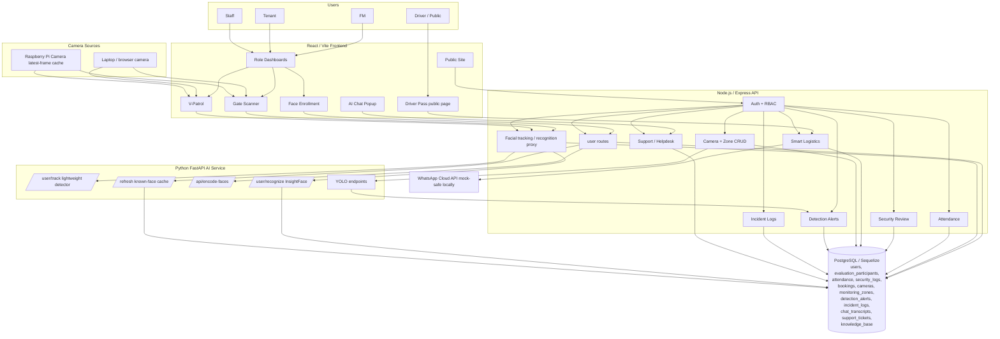

# FlowGuard - System Architecture Diagram (merged system)

## Notes

- Laptop and Raspberry Pi camera sources provide frames. The Pi serves latest-frame snapshot/stream data; heavy InsightFace recognition remains on the laptop AI service.
- `/user/track` is side-effect-free tracking telemetry. `/user/recognize` performs full identity matching. Attendance and SecurityLog writes happen through Node routes after frontend scanner policy checks.
- `evaluation_participants` stores stable evaluation labels for the FM validation workflow.
- DetectionAlert records are associated with Camera and MonitoringZone when resolvable. IncidentLog records are separate; alert-to-incident seeding is an application workflow, not a database relationship.
