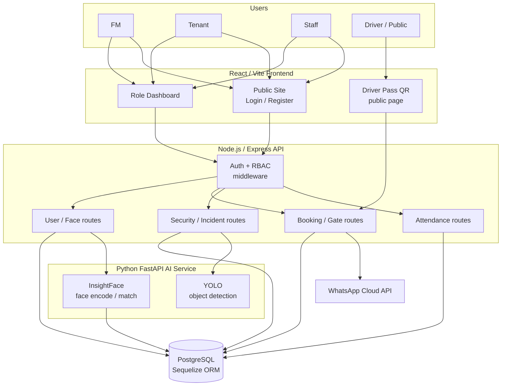
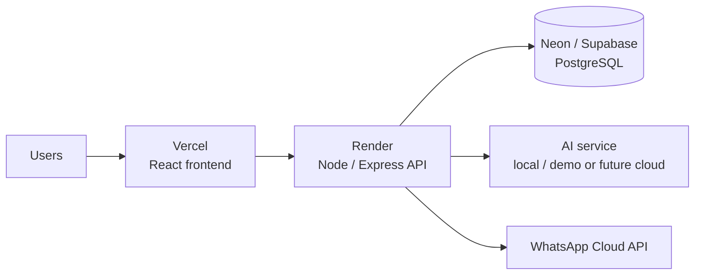

# FlowGuard — System Architecture Diagram

## Planned deployment

## Notes

- **Frontend (React/Vite):** public marketing site, login/register, a role-aware dashboard, and a
  public Driver Pass QR page that needs no login.
- **Backend (Node/Express):** every request passes through JWT auth + role-based access control
  before reaching user/face, booking/gate, security/incident, or attendance routes.
- **Database (PostgreSQL + Sequelize):** one shared instance for users, bookings, attendance,
  security logs, detection alerts, incident logs, monitoring zones, and invites.
- **AI service (Python FastAPI):** InsightFace encodes/matches faces; YOLO detects objects. It
  reads/refreshes enrolled face vectors from the same database. Face embeddings are stored as a
  PostgreSQL `FLOAT[]` array (`faceVector`); pgvector is not required.
- **WhatsApp Cloud API:** external side-effect for driver notifications; can run in simulated mode locally or real mode when valid WhatsApp Cloud API environment variables are enabled.
- **Deployment intent:** Vercel (frontend), Render (backend), Neon/Supabase (PostgreSQL). The AI
  service (InsightFace/YOLO) is heavy, so it runs locally for the demo, with cloud hosting as a
  stretch goal. After deploying, `FRONTEND_URL` must be updated so WhatsApp driver-pass links point
  to the live site.
- PNG export `design/png/architecture-diagram.png` must be regenerated manually from this Mermaid source.
