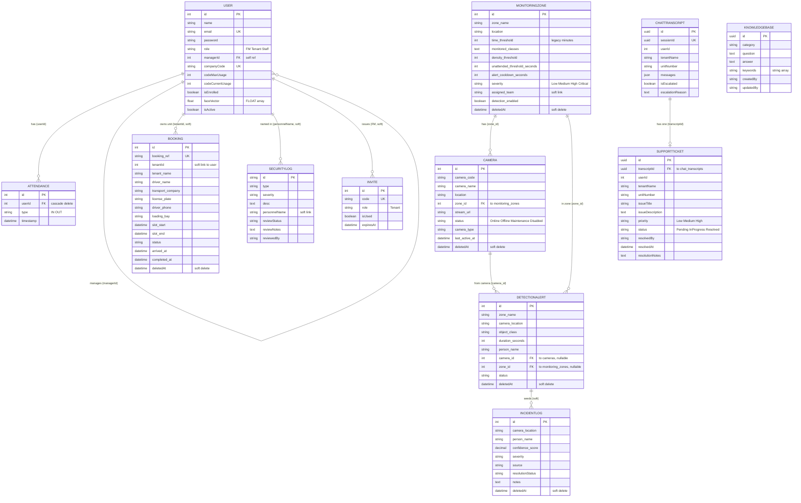

# FlowGuard — Entity Relationship Diagram (merged system)

## Notes

- **Enforced FK relationships:** `ATTENDANCE.userId → USER.id` (ON DELETE CASCADE); `USER.managerId →
  USER.id` self-reference (Tenant ⟶ Staff); `CAMERA.zone_id → MONITORINGZONE.id`;
  `DETECTIONALERT.camera_id → CAMERA.id` and `DETECTIONALERT.zone_id → MONITORINGZONE.id` (both
  nullable — the AI engine's string payload still works); `SUPPORTTICKET.transcriptId →
  CHATTRANSCRIPT.id` (ChatTranscript `hasOne` SupportTicket).
- **Soft links (no DB-level FK, matched at query time):**
  - `BOOKING.tenantId → USER.id` — Staff bookings use the Staff member's `managerId`.
  - `SECURITYLOG.personnelName → USER.name` — nulled on PDPA off-boarding.
  - `MONITORINGZONE.assigned_team` — free-text response-team name, not an FK.
  - `DETECTIONALERT → INCIDENTLOG` — object-detection alerts can seed incident records (soft workflow).
- **KNOWLEDGEBASE** is standalone FAQ data used by the AI Helpdesk to match incoming chat messages.
- `faceVector` is a PostgreSQL `FLOAT[]` array (Sequelize `ARRAY(FLOAT)`) — **not pgvector**
  (pgvector not required).
- Soft-deletable (`paranoid`) tables keep a `deletedAt` timestamp: bookings, cameras, monitoring
  zones, detection alerts, incident logs.
- **After editing this diagram, regenerate `design/png/er-diagram.png`** from this Mermaid source.
