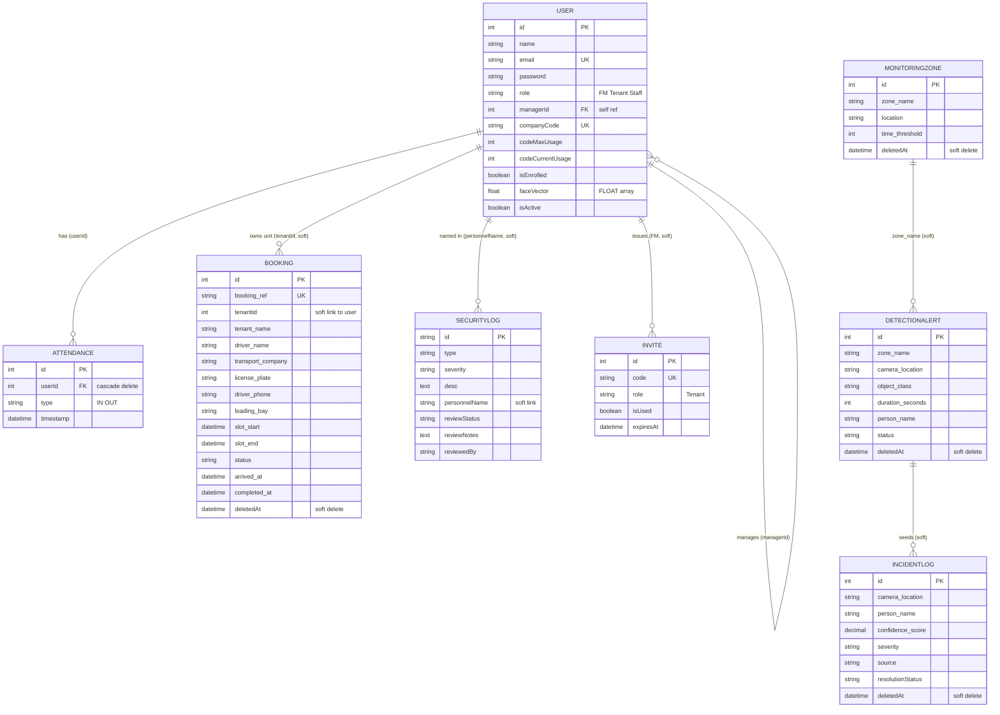

# FlowGuard — Entity Relationship Diagram

## Notes

- **Solid FK relationships (enforced):** `ATTENDANCE.userId → USER.id` (ON DELETE CASCADE) and the
  `USER.managerId → USER.id` self-reference (Tenant ⟶ their Staff).
- **Soft links (no DB-level FK, matched at query time):**
  - `BOOKING.tenantId → USER.id` — links a booking to the tenant/unit; Staff bookings use the
    Staff member's `managerId`.
  - `SECURITYLOG.personnelName → USER.name` — access/intrusion events tie to a person by name;
    nulled on PDPA off-boarding.
  - `DETECTIONALERT.zone_name → MONITORINGZONE.zone_name` — alerts reference a zone by name.
  - `DETECTIONALERT → INCIDENTLOG` — object-detection alerts can seed incident records in the
    incident dashboard (teammate-owned modules).
  - `INVITE` is generated by an FM but has no FK to the creator.
- `faceVector` is a PostgreSQL `FLOAT[]` array (Sequelize `ARRAY(FLOAT)`), not pgvector.
- Soft-deletable (`paranoid`) tables keep a `deletedAt` timestamp: bookings, detection alerts,
  incident logs, monitoring zones.
- PNG export (`er-diagram.png`) must be regenerated manually from this Mermaid source.
