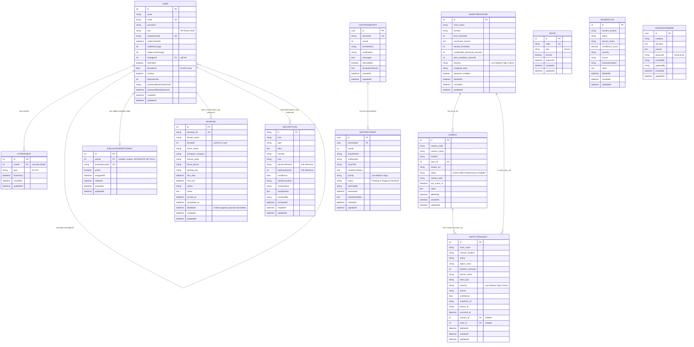

# FlowGuard - Entity Relationship Diagram (merged system)

## Notes

- `evaluation_participants` stores stable labels such as P01/P02/P03. Labels remain reserved after user off-boarding; the record is retired and its `userId` is set to null.
- Invite has no issuer/user foreign key in the actual model. Invite creation is role-controlled at application level only.
- DetectionAlert and IncidentLog are not database-linked. A detection-alert route may attempt to seed an IncidentLog, but the records are not linked by a database foreign key.
- `BOOKING.deletedAt` exists because the Sequelize model supports paranoid soft deletion. The current manual Cancel workflow does not call destroy/delete; it performs status-based logical cancellation with `status = Cancelled`.
- `faceVector` is a PostgreSQL `FLOAT[]` array. InsightFace generates 512-dimensional facial embeddings and the Python AI service performs similarity matching.
- Soft-deletable model tables: bookings, cameras, monitoring_zones, detection_alerts, incident_logs.
