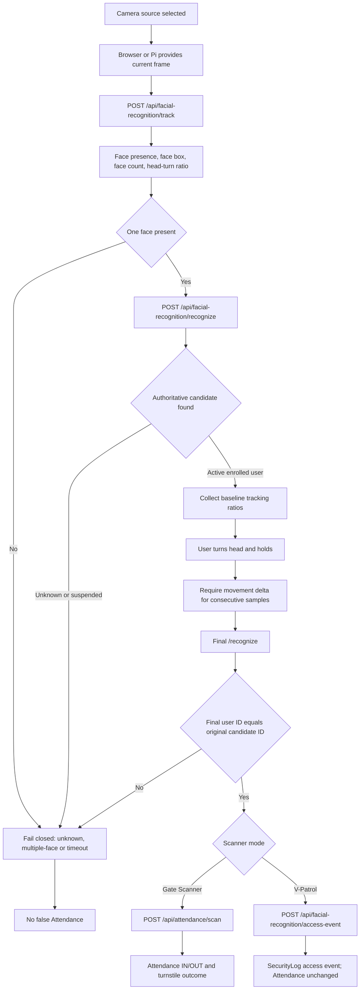
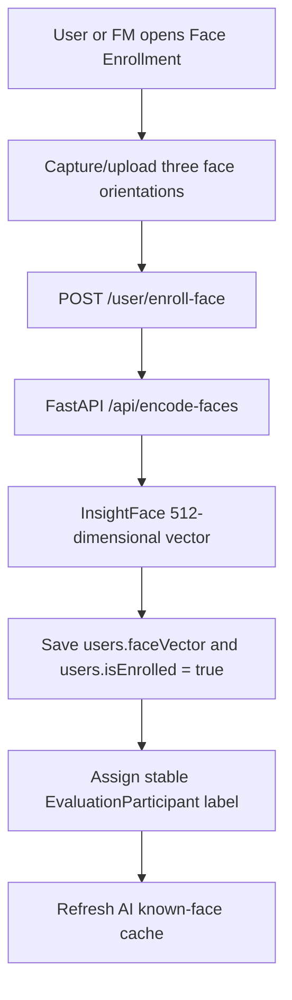
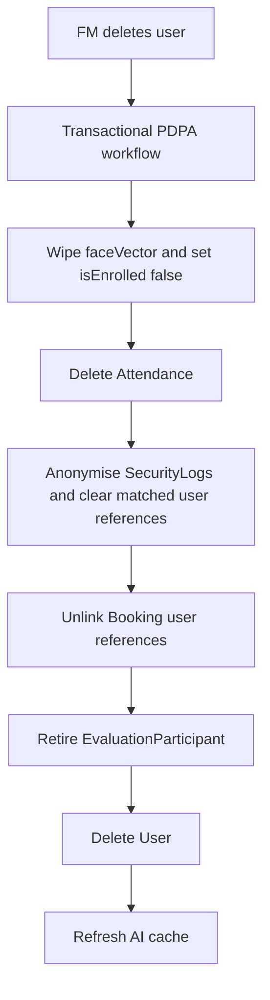

# FlowGuard - Facial Recognition & Access Management Flow

## Recognition flow

Motion liveness uses head-turn verification. This is not documented as a complete anti-spoofing model.

## Enrolment flow

## Off-boarding flow

## Notes

- Tracking (`/api/facial-recognition/track`) is detector-only and has no identity, DB, Attendance or SecurityLog side effects.
- Recognition (`/api/facial-recognition/recognize`) identifies a candidate using the authoritative user ID/status from PostgreSQL.
- Gate Scanner performs tracking, initial recognition, baseline head-turn verification, final same-ID recognition and then `/api/attendance/scan`.
- V-Patrol performs the same scanner policy but writes `/api/facial-recognition/access-event`; Attendance is unchanged.
- Unknown, suspended, multiple-face and timeout cases fail closed. Unknown/suspended recognition creates SecurityLog access/intrusion events according to the current routes, not IncidentLog records.
