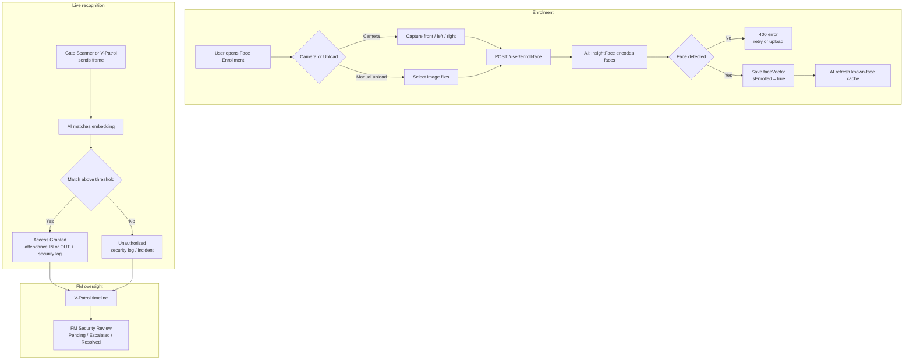
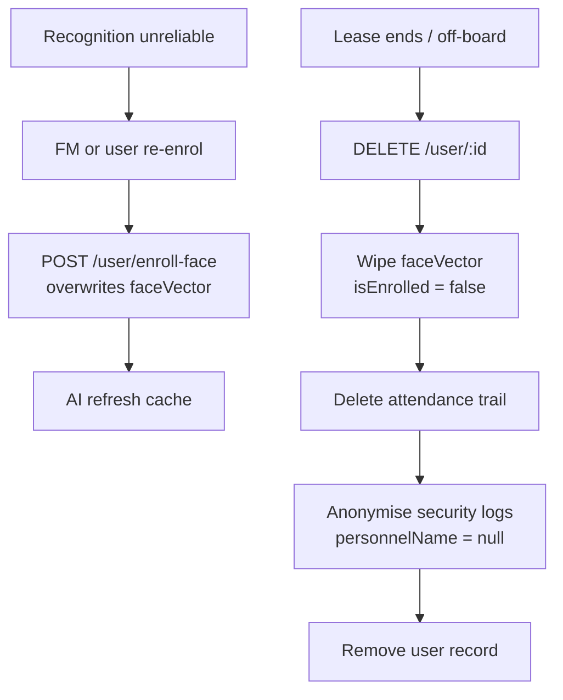

# FlowGuard — Facial Recognition & Access Management Flow

## Enrolment + recognition + review

## Re-enrolment + off-boarding

## Notes

- Enrolment sends captured/uploaded images to the Python AI service, which encodes them with
  InsightFace and returns a 512-d vector stored as `faceVector` (`FLOAT[]`).
- After a successful enrolment the backend calls the AI `/refresh` endpoint so a new face is
  recognised immediately without restarting the service (non-fatal if it fails).
- Recognised users generate an IN/OUT attendance record plus an access security log; unknown faces
  generate an intrusion security log (and can seed the incident dashboard).
- Off-boarding is PDPA-aware: biometric vector wiped, attendance removed, security logs anonymised.
- All camera pages degrade gracefully if the webcam is denied or the AI service is offline.
