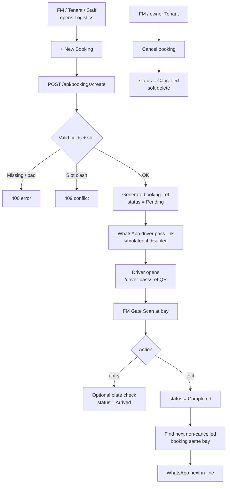
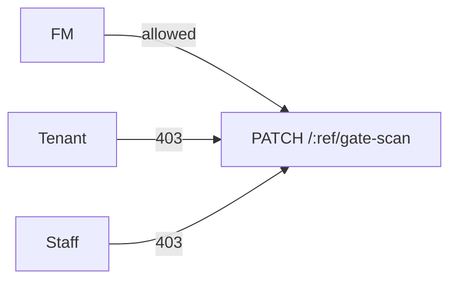

# FlowGuard — Smart Logistics & Loading Bay Flow

## Booking to gate to next-in-line

## Role gate on Gate Scan

## Notes

- **Create:** FM, Tenant, and Staff can create bookings. Staff book on behalf of their unit — the
  booking's `tenantId` is set from the Staff member's `managerId`. Validation returns 400 for
  missing/invalid fields and 409 for an overlapping slot in the same bay.
- **WhatsApp:** a driver-pass link is sent on create (and on status changes). In local/demo mode
  it is simulated; the API response reports the send status.
- **Driver Pass:** the public `/driver-pass/:ref` page shows booking details + a QR encoding the
  booking reference; it needs no login.
- **Gate Scan (FM only):** entry moves Pending/Confirmed → Arrived; exit moves → Completed. An
  optional observed plate is compared to the booking plate and flagged on mismatch (warn, not block).
- **Next-in-line:** completing a booking notifies the next waiting booking for the same bay,
  supporting the "previous driver left early, notify the next driver" requirement.
- **Cancel:** FM or the owning Tenant soft-cancels (status = Cancelled, `paranoid` soft delete).
- **Restrictions:** Tenant and Staff cannot Gate Scan or Mark Arrived/Completed (facility-level, FM only).
