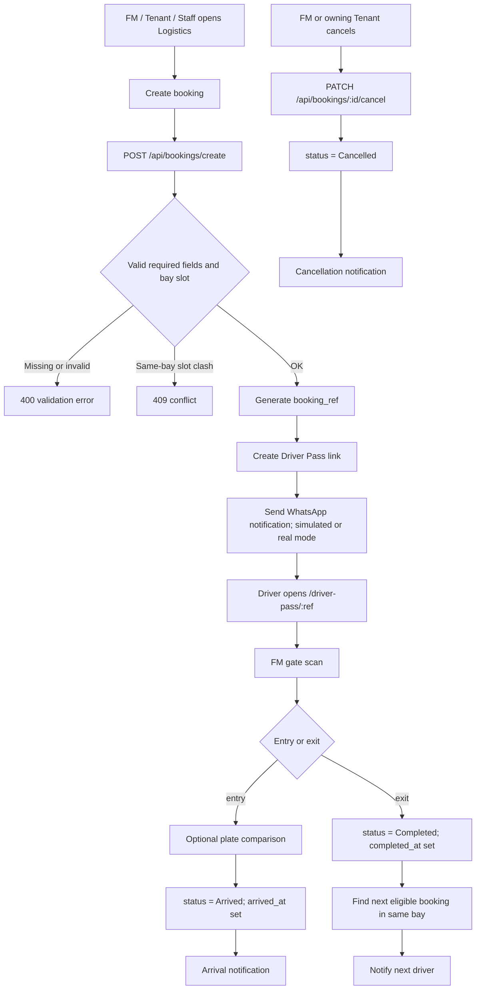
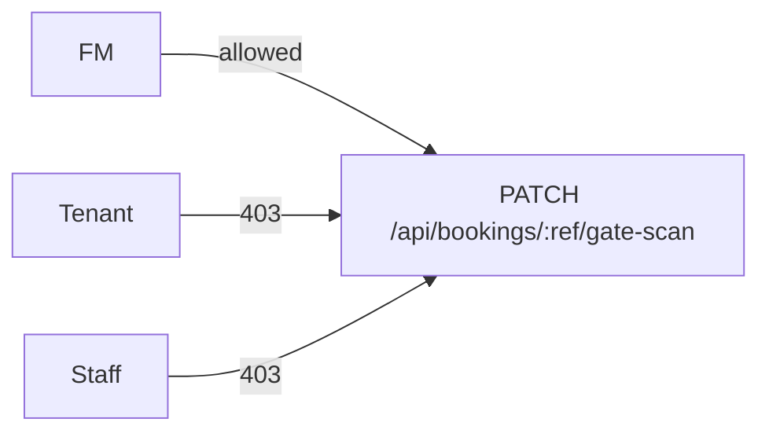

# FlowGuard - Smart Logistics & Loading Bay Flow

## Booking to gate to next-in-line

## Role gate on Gate Scan

## Notes

- Booking creation validates required fields, enforces role/ownership rules, detects same-bay slot conflicts, generates `booking_ref`, creates a public Driver Pass link and sends a mock-safe WhatsApp notification.
- Gate entry sets `status = Arrived` and `arrived_at` after optional plate comparison.
- Gate exit sets `status = Completed` and `completed_at`, then locates the next eligible booking in the same bay for notification.
- Cancellation is logical cancellation through status: `PATCH /api/bookings/:id/cancel` sets `status = Cancelled` and sends a cancellation notification. It is not the manual UI path for Sequelize paranoid soft delete.
