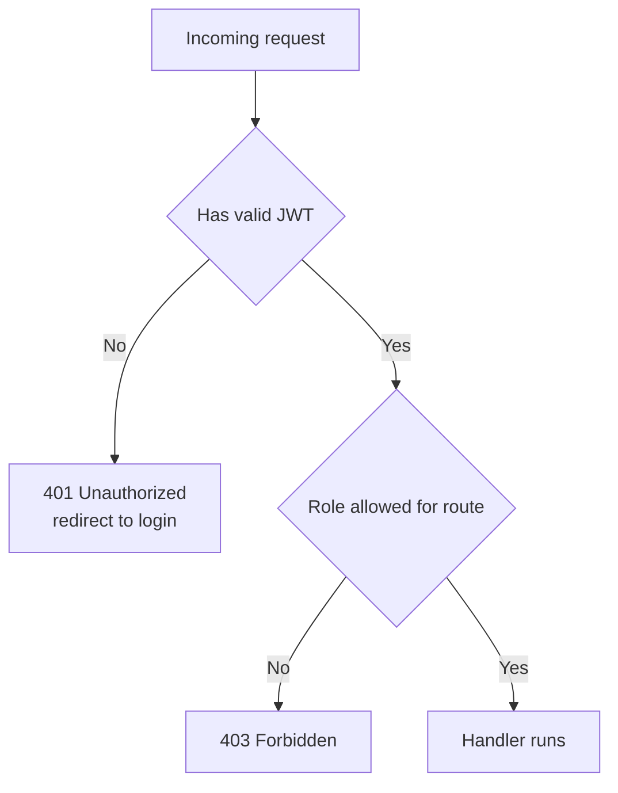
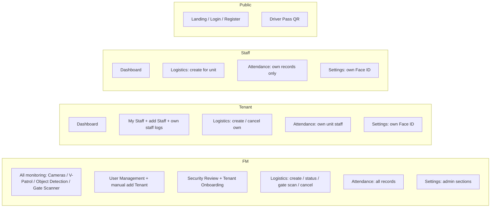

# FlowGuard — Role-Based Access Control (RBAC)

## Request flow

## Role capability map

## Access matrix

| Page / action | FM | Tenant | Staff | Public |
|---------------|:--:|:--:|:--:|:--:|
| Landing / Login / Register | ✅ | ✅ | ✅ | ✅ |
| Driver Pass QR `/driver-pass/:ref` | ✅ | ✅ | ✅ | ✅ |
| Dashboard | ✅ | ✅ | ✅ | ❌ |
| Cameras / V-Patrol / Object Detection / Gate Scanner | ✅ | ❌ | ❌ | ❌ |
| Daily Attendance | all | own staff | own only | ❌ |
| Logistics — view | all | own unit | own unit | ❌ |
| Logistics — create booking | ✅ | ✅ | ✅ | ❌ |
| Logistics — cancel | ✅ | own | ❌ | ❌ |
| Logistics — Mark Arrived/Completed | ✅ | ❌ | ❌ | ❌ |
| Gate Scan (entry/exit) | ✅ | ❌ | ❌ | ❌ |
| My Staff (add Staff, own staff logs) | ❌ | ✅ | ❌ | ❌ |
| User Management (add Tenant, suspend/delete) | ✅ | ❌ | ❌ | ❌ |
| Security Review | ✅ | ❌ | ❌ | ❌ |
| Tenant Onboarding (invites) | ✅ | ❌ | ❌ | ❌ |
| Settings — own Face ID re-enrol | ✅ | ✅ | ✅ | ❌ |
| Settings — admin (AI / network / danger) | ✅ | ❌ | ❌ | ❌ |

## Notes

- Enforced on **both** layers: React `ProtectedRoute` (with role allow-lists) and Express
  `verifyToken` + `requireRole` middleware. The frontend also hides controls a role cannot use so
  users never click into a 403.
- **401** = not logged in (redirect to login). **403** = logged in but insufficient role.
- "Staff" means a tenant/factory worker (not a security officer), so Staff are kept out of AI/security
  monitoring pages and facility-level gate control.
- FM accounts are provisioned via the seed/setup script only — they cannot be created from the UI.
